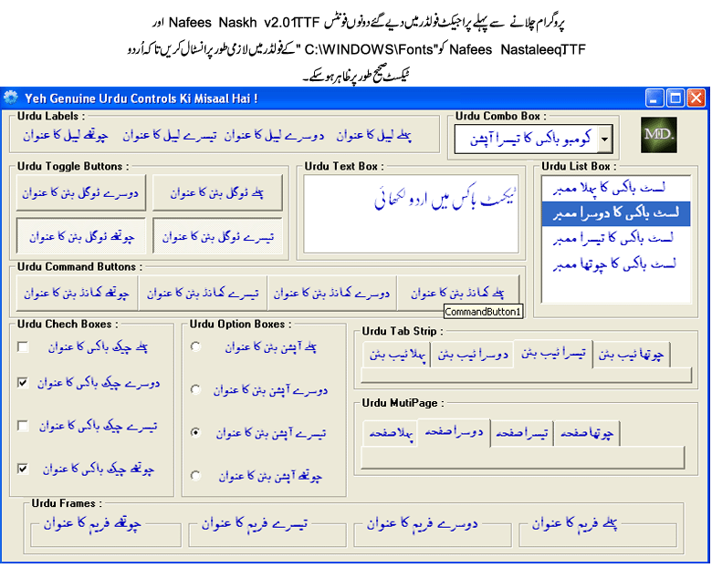



## Urdu Programming Controls \(Simple\)

### Description

Pre-Requirements : Pak Urdu Installer Or East Asian Language Support (XP)

 http://www.mbilalm.com/download/ 

 Introducing first time on the whole world of internet, there are all Urdu Programming Controls in VB6. You will not be able to find anywhere else. When I've started to fight for Urdu Language's Programming, i realized that there are no Urdu Programming Controls (UPC) available anywhere, that programmer can use for there Urdu Language programming. So, it is a effort by me to solve this problem. These are only the 'Simple' controls to show only that how these controls can be made and used in VB6 applications. I hope, all beginners & professionals will like it. I 'll feel glade to get feedback from all buddies. Please give me your feedback on my email address (ME_IQ_TM@Yahoo.Com) about this code, Also must rate & vote for this code on PlanetSourceCode. Thank You. 

 Join Urdu Programming at Facebook 

 http://www.facebook.com/pages/Urdu-Programming-VB6/263338567072301 
 
### More Info
 

             |
---                |---
**Submitted On**   |2011-04-01 18:50:28
**By**             |[Mehmood Iqbal](https://github.com/Planet-Source-Code/PSCIndex/blob/master/ByAuthor/mehmood-iqbal.md)
**Level**          |Intermediate
**User Rating**    |5.0 (15 globes from 3 users)
**Compatibility**  |VB 6\.0
**Category**       |[Custom Controls/ Forms/  Menus](https://github.com/Planet-Source-Code/PSCIndex/blob/master/ByCategory/custom-controls-forms-menus__1-4.md)
**World**          |[Visual Basic](https://github.com/Planet-Source-Code/PSCIndex/blob/master/ByWorld/visual-basic.md)
**Archive File**   |[Urdu\_Progr220107412011\.zip](https://github.com/Planet-Source-Code/mehmood-iqbal-urdu-programming-controls-simple__1-73840/archive/master.zip)

